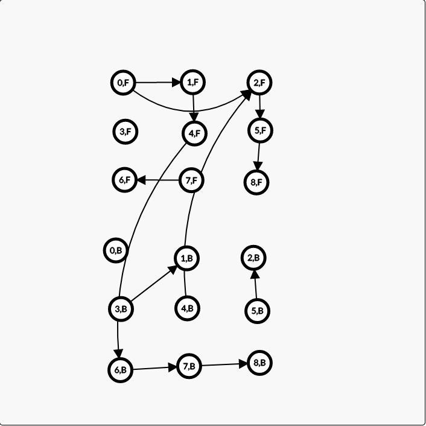

# Graph Modelling Project

- Fisher Darling \
  11/26/2019 \
  10828285

## 1) Problem Modeling

**a)** The first thing I did was solve the problem without constraints, that is model the movements of the arrows as edges in the graph. For each cell on the board, I constructed a directed graph with that cell as a node and that node's edges all pointing arrows of the opposite color that are along its cardinal direction. This solution had no circles.

Secondly, I augmented the current graph with enough information to allow for circles. To do this I first created two "subgraphs" within the same graph. Each subgraph encodes the transitions from either going forwards (heads) or backwards (tails) from each arrow. So there was a forwards and backwards "graph". Then, every time I was calculating the transitions of a circle, I flipped it's cardinal direction and, rather than connecting to other edges in the same subgraph, I connected them to the corresponding nodes in the opposite subgraph. This linked the graphs together while encoding the idea of forwards or backwards traversal.

By connecting the circles to the opposite subgraph, the search algorithm I used, `A*`, would then be able to make decisions based off of traversing into the opposite subgraph (by ending on a circle) or skipping over it and remaining in the current one.

**b)**

The following represents both forward and backwards states for some input. The upper grouping of 9 are the forward transitions and the bottom group the backwards. Node `4,F` is a circle and its transitions are opposite to what the input might expect. This accounts for the reversal of direction that occurs. It also show that node 4 "moves" us from one graph to the other. A possible solution is `0,F 1,F 4,F 6,B 7,B, 8,B`.



**c)**

I used **A\*** to find the path. But, since my weights we're all the same, and the heuristic was constant, the actual algorithm was essentially dijkstra's (BFS).

**d)**

The algorithm builds every possible state transition, and connects
them fully. If a shortest path does exist, then `A*` (BFS in our case), _will always_ find the shortest path since the heuristic is constant and admissible.

## 2) Code Submission

The following is two snippets of code, the first snippet executing the forward pass, and the second snippet executing `A*` on the final graph.

The full source and instructions for executing the code can be found on github at: https://github.com/fisherdarling/maze_project

Calculate the forward nodes:

```rust
for i in 0..i {
    for j in 0..j {
        let arrow = grid[i][j];

        // Skip the target node
        if arrow.is_target() {
            continue;
        }

        // Determine which map we are reading from. If it is a circle,
        // the map we use is opposite to what pass we are on (forward).
        let map = if arrow.is_circle() {
            &backward_nodes
        } else {
            &forward_nodes
        };

        // Get the "velocity" or the vector direction of our arrow's direction.
        let mut vel = get_vel(arrow.direction);

        // If it is a circle, we multiply the velocity by -1.
        if arrow.is_circle() {
            vel = Coord(-1 * vel.0, -1 * vel.1);
        }

        // Iterate through the nodes, beginning at our current one,
        // adding to the velocity as we go.
        let mut start = arrow.loc;
        let start_idx = forward_nodes[&start].clone();

        start += vel;
        while self.input.in_bounds(&start) {
            let check_arrow = grid[start.0 as usize][start.1 as usize];

            // Only create an edge for notes that are the same color.
            if check_arrow.color != arrow.color {
                graph.add_edge(start_idx, map[&start].clone(), 0usize);
            }

            start += vel;
        }
    }
}
```

\
\
Executing `A*`:

```rust
let (_, path) = astar(
        &graph,
        start,                              // start
        |n| n == target_f || n == target_b, // is_goal
        |e| *e.weight(),                    // edge_cost
        |_| 0,                              // estimate_cost
    )
    .or_else(|| Some((0, vec![])))
    .unwrap();
```

## 3) Results:

On the provided input, my algorithm generated the following solution:

```
(1 1) (1 6) (5 2) (6 2) (7 2) (2 2) (4 2) (2 4) (6 4) (6 7) (2 7) (6 3) (7 4) (5 6) (4 5) (5 5) (2 5) (3 5) (6 5) (4 3) (4 5) (3 5) (1 5) (5 5) (6 5) (7 6) (2 1) (4 3) (4 1) (7 1) (4 4) (1 7) (7 7)
```

## 4) Extra Credit:

For this project I used the Rust graph library [petgraph](https://docs.rs/petgraph/0.4.13/petgraph/). I am very happy to have found and to have used this library, since writing a graph from scratch in Rust is _not_ fun.
